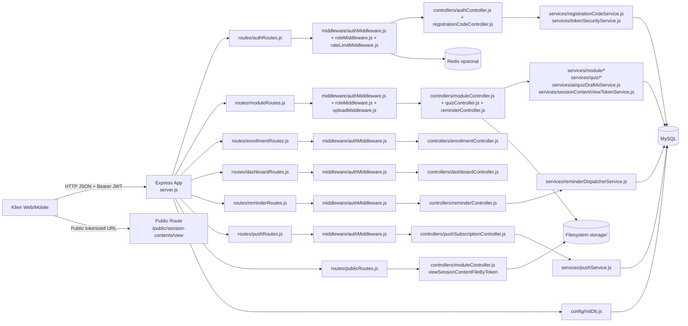

OK, all files (excluding ignored directories) have been fully read and analyzed.

## A. Diagram Arsitektur Sistem

Arsitektur menunjukkan pola berlapis route-controller-service dengan pemisahan concern yang konsisten. Lapisan middleware menangani autentikasi, otorisasi, validasi upload, dan pembatasan laju; controller menjaga kontrak HTTP; service mengenkapsulasi aturan bisnis dan query SQL. Inisialisasi skema dilakukan saat bootstrap (`server.js` memanggil `config/initDb.js`), sehingga deployment tidak memerlukan migrator eksternal. Data flow bersifat sinkron request-response untuk operasi utama, serta asinkron periodik untuk reminder dispatcher (`services/reminderDispatcherService.js`) yang menulis notifikasi in-app dan memicu web push melalui `services/pushService.js`.

## B. Analisis Kebutuhan Sistem (Berbasis Riset)

### B.1 Kebutuhan Fungsional

1. **Manajemen autentikasi berbasis JWT dan logout-revocation**
   - Deskripsi: Sistem wajib menyediakan registrasi, login, dan logout dengan token bearer yang dapat dicabut.
   - Evidence: Route `POST /api/auth/register|login|logout` pada `routes/authRoutes.js`; validasi token di `middleware/authMiddleware.js`; blacklist token pada `services/tokenSecurityService.js` dan tabel `revoked_auth_tokens` di `config/initDb.js`.

2. **Registrasi berbasis kode dengan kontrol peran**
   - Deskripsi: Registrasi user harus tervalidasi oleh kode registrasi yang menentukan role final (`teacher|student`) dan batas pemakaian.
   - Evidence: Validasi `registration_code` pada `controllers/authController.js`; logika kuota/expired/target role di `services/registrationCodeService.js`; tabel `registration_codes` dan `registration_code_usages`.

3. **Manajemen modul pembelajaran dan enroll key**
   - Deskripsi: Teacher/admin wajib dapat CRUD modul, banner, serta regenerasi enroll key; student hanya membaca modul ter-enroll.
   - Evidence: `routes/moduleRoutes.js` + `controllers/moduleController.js`; kontrol akses `services/module/moduleAccessService.js`; relasi modul-enrollment pada tabel `modules`, `module_enrollments`.

4. **Manajemen sesi, jadwal buka, dan gating akses student**
   - Deskripsi: Sistem harus mendukung CRUD sesi, pengaturan `open_at`, dan pembatasan akses sebelum waktu buka.
   - Evidence: Endpoint schedule pada `controllers/moduleController.js`; fungsi `isSessionLockedForStudent` di `services/module/moduleAccessService.js` dan `services/quiz/quizAccessService.js`.

5. **Manajemen konten sesi multi-tipe (file/url/text)**
   - Deskripsi: Guru perlu menambah, memperbarui, menghapus, dan mengunduh konten sesi dengan validasi tipe konten.
   - Evidence: `addSessionContent/updateSessionContent/deleteSessionContent` pada `controllers/moduleController.js`; helper di `services/module/sessionContentService.js`; filter MIME di `middleware/uploadMiddleware.js`.

6. **Public view URL bertoken untuk dokumen non-media**
   - Deskripsi: Dokumen tertentu harus bisa diakses tanpa bearer melalui URL jangka pendek.
   - Evidence: `createSessionContentViewUrl` dan `viewSessionContentFileByToken` pada `controllers/moduleController.js`; token signing/verifying di `services/sessionContentViewTokenService.js`.

7. **Quiz per sesi: lifecycle lengkap**
   - Deskripsi: Sistem wajib menyediakan create/update/publish quiz, CRUD question, media question, start/submit attempt, review essay, leaderboard, dan hapus attempt.
   - Evidence: Route quiz pada `routes/moduleRoutes.js`; orkestrasi di `controllers/quizController.js`; scoring/review/leaderboard/delete attempt di `services/quiz/quizAttemptService.js`.

8. **Auto-grading MCQ + manual grading essay**
   - Deskripsi: MCQ dinilai otomatis saat submit, sedangkan essay menunggu review pengajar hingga final score diputuskan.
   - Evidence: Perhitungan skor `computeScoreMetrics` dan status transition (`submitted_pending_review`, `graded`) di `services/quiz/quizAttemptService.js`; skema `quiz_attempts`/`quiz_attempt_answers`.

9. **Pembuatan draft quiz berbasis AI dari konten sesi**
   - Deskripsi: Teacher/admin harus dapat menghasilkan draft soal berdasarkan konteks konten sesi (PDF/text), dengan fallback manual context.
   - Evidence: `generateQuizDraft` di `controllers/quizController.js`; ekstraksi PDF + prompt + normalisasi output di `services/ai/quizDraftAiService.js`.

10. **Reminder sesi dan push notification**
    - Deskripsi: Student dapat menyetel reminder; backend menjalankan dispatcher berkala untuk notifikasi in-app dan web push.
    - Evidence: `controllers/reminderController.js`, `controllers/pushSubscriptionController.js`, scheduler `services/reminderDispatcherService.js`, pengiriman push `services/pushService.js`.

### B.2 Kebutuhan Non-Fungsional

1. **Keamanan akses dan otorisasi**
   - JWT wajib pada endpoint privat, role-based access diterapkan eksplisit, token revocation mencegah reuse pasca logout.
   - Evidence: `middleware/authMiddleware.js`, `middleware/roleMiddleware.js`, `services/tokenSecurityService.js`.

2. **Konsistensi data transaksional**
   - Operasi multi-langkah kritis (registrasi + usage code, submit/review attempt) menggunakan transaksi database.
   - Evidence: `controllers/authController.js` (transaction register), `services/quiz/quizAttemptService.js` (submit/review).

3. **Integritas skema dan idempotensi bootstrap**
   - Inisialisasi tabel dilakukan idempotent (`CREATE TABLE IF NOT EXISTS`, `ALTER ...` terjaga error code), cocok untuk provisioning bertahap.
   - Evidence: `config/initDb.js`.

4. **Kinerja dan pembatasan beban**
   - Rate limiter mendukung Redis (distributed) dan fallback memory; list endpoint memakai pagination response helper.
   - Evidence: `middleware/rateLimitMiddleware.js`, `utils/listResponse.js`.

5. **Kapasitas file dan kompatibilitas media**
   - Upload dibatasi 200MB dan whitelist MIME; mencegah payload tak terkontrol.
   - Evidence: `middleware/uploadMiddleware.js`.

6. **Skalabilitas operasional terbatas stateful storage**
   - Desain data utama scalable di MySQL, tetapi file berada di local filesystem (`storage/`) sehingga horizontal scaling memerlukan shared object storage.
   - Evidence: operasi path/file di `controllers/moduleController.js`, `controllers/quizController.js`, `services/module/moduleStorageService.js`, `services/quiz/quizStorageService.js`.

7. **Observabilitas minimum**
   - Sistem memiliki logging operasional dasar (startup, redis mode, dispatcher error), namun belum ada metrics/tracing terstruktur.
   - Evidence: `server.js`, `config/redis.js`, `services/reminderDispatcherService.js`.

### B.3 Hasil Simulasi Riset

**Asumsi metodologis**: karena data lapangan tidak tersedia, inferensi dilakukan dari artefak kode sebagai proksi wawancara (intent pengembang), survei (kebutuhan pengguna), dan observasi (perilaku aktual runtime).

1. **Wawancara (inferensi intent pengembang)**
   - Pengembang menargetkan LMS role-based yang ketat, terlihat dari pemisahan akses admin/teacher/student di hampir semua controller dan service akses.
   - Fokus pada integritas evaluasi belajar, tercermin pada model attempt multi-status, pemisahan skor otomatis/manual, dan verifikasi publish readiness quiz.
   - Ada intent iterative-hardening: penambahan kolom/alter di `initDb`, endpoint delete attempt, leaderboard visibility, serta token revocation.

2. **Survei (inferensi kebutuhan pengguna)**
   - **Teacher/admin** membutuhkan authoring cepat: create module otomatis 3 sesi, upload konten fleksibel, AI draft quiz, serta review essay terpusat.
   - **Student** membutuhkan akses belajar terstruktur: enrollment key, gating jadwal sesi, attempt quiz terukur durasi, reminder personal.
   - **Operasional institusi** membutuhkan onboarding terkontrol: registration code dengan batas penggunaan, masa berlaku, dan pelacakan pemakaian.

3. **Observasi (inferensi perilaku sistem aktual)**
   - Sistem berjalan sebagai monolit Express dengan MySQL-centric transaction boundary; tidak ada message broker, sehingga konsistensi bergantung pada ACID DB.
   - Notifikasi reminder bersifat polling periodik (`setInterval`) dengan deduplikasi berbasis payload notifikasi sebelumnya.
   - Dokumentasi endpoint terintegrasi di `index.html` menunjukkan orientasi implementatif untuk tim frontend dan QA.
   - Risiko utama implementasi saat ini berada pada aspek secret management (`.env` berisi kredensial aktual), bukan pada ketiadaan mekanisme autentikasi.

## C. Rencana Timeline Pengembangan

### Phase 1: Initialization & Setup

- **Aktivitas kunci**: penyiapan project Express, konfigurasi `.env`, koneksi MySQL (`config/db.js`), bootstrap schema (`config/initDb.js`), baseline middleware.
- **Dependensi**: infrastruktur DB aktif, variabel environment minimum, standar role pengguna.
- **Estimasi durasi**: 1-2 minggu.

### Phase 2: Core Development

- **Aktivitas kunci**: implementasi auth + registration codes + module/sessions/contents + enrollment + dashboard; finalisasi akses role-based.
- **Dependensi**: Phase 1 selesai, definisi use-case guru/siswa disepakati, kontrak API awal stabil.
- **Estimasi durasi**: 3-5 minggu.

### Phase 3: Feature Expansion

- **Aktivitas kunci**: implementasi ekosistem quiz lengkap (question media, attempt lifecycle, auto/manual scoring, leaderboard, delete attempt), endpoint docs terstruktur.
- **Dependensi**: model data quiz matang, modul dan sesi telah operasional.
- **Estimasi durasi**: 3-4 minggu.

### Phase 4: Optimization

- **Aktivitas kunci**: reminder dispatcher, push subscription management, rate limiting berbasis Redis, perbaikan validasi dan stabilitas error handling.
- **Dependensi**: fitur inti berjalan end-to-end, environment push/VAPID tersedia, Redis opsional tersedia.
- **Estimasi durasi**: 2-3 minggu.

### Phase 5: Deployment

- **Aktivitas kunci**: hardening security (rotasi secret, segregasi env), persiapan release, uji regresi API, monitoring operasional dasar, dokumentasi lampiran final.
- **Dependensi**: seluruh phase sebelumnya stabil, data awal pengguna/role siap, prosedur operasional disetujui.
- **Estimasi durasi**: 1-2 minggu.
